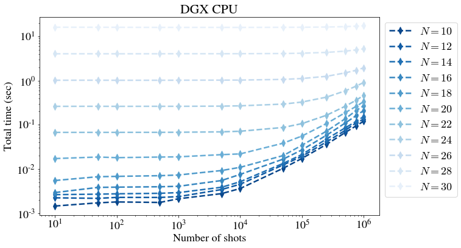
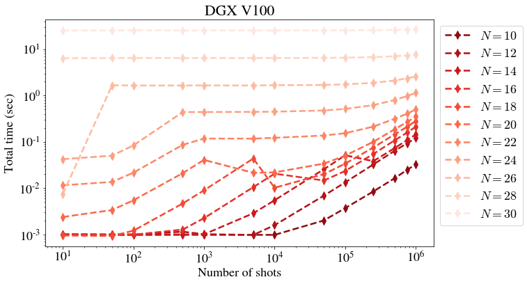

# Measurement Shots Benchmark

Qibo simulates quantum measurements using its standard dense state vector
simulator, followed by sampling from the distribution corresponding to the final
state vector. Since the dense state vector is used instead of repeated circuit
executions, measurement time does not have a strong dependence on the number of
shots.
The plots and numbers below contain only the time required for sampling
as the state vector simulation time (time required to apply gates) has been
subtracted from the total execution time. The circuit used in this benchmark
consists of a layer of ``H`` gates applied to every qubit followed by a
measurement of all qubits.

`nshots` | CPU N=12 | GPU N=12 | CPU N=22 | GPU N=22
-- | -- | -- | -- | --
10 | 0.00222 | 0.001 | 0.06738 | 0.01154
50 | 0.00216 | 0.00099 | 0.06737 | 0.01367
100 | 0.00227 | 0.00099 | 0.06743 | 0.0216
500 | 0.00227 | 0.00115 | 0.06756 | 0.08641
1000 | 0.00236 | 0.00101 | 0.06785 | 0.11819
5000 | 0.00342 | 0.00098 | 0.06934 | 0.11781
10000 | 0.00452 | 0.00158 | 0.07157 | 0.12264
50000 | 0.01242 | 0.0069 | 0.08722 | 0.13751
100000 | 0.01939 | 0.01337 | 0.10656 | 0.15444
250000 | 0.04117 | 0.03254 | 0.16497 | 0.21442
500000 | 0.07463 | 0.06422 | 0.26315 | 0.31621
750000 | 0.11058 | 0.09289 | 0.35994 | 0.40627
1000000 | 0.13462 | 0.12177 | 0.46654 | 0.50615

